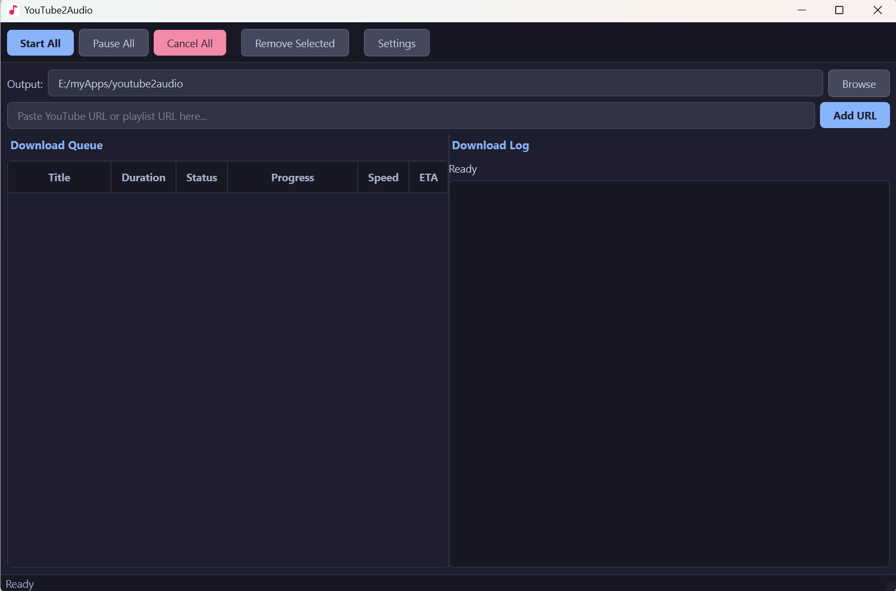
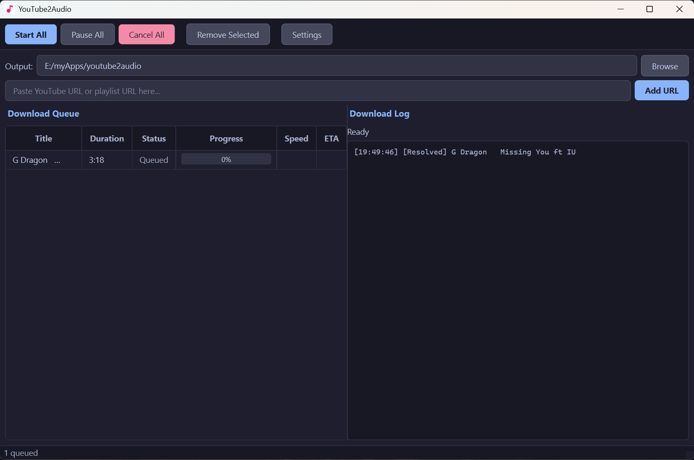
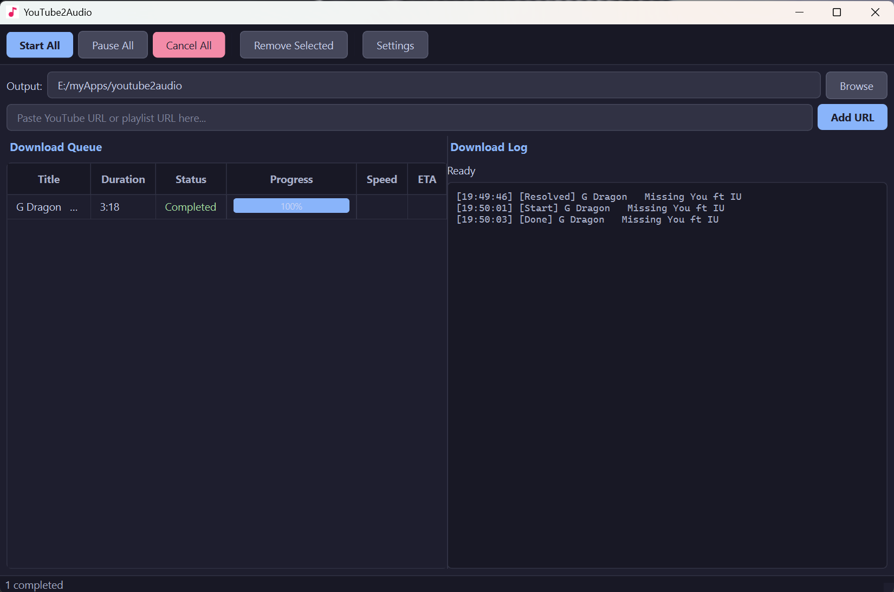
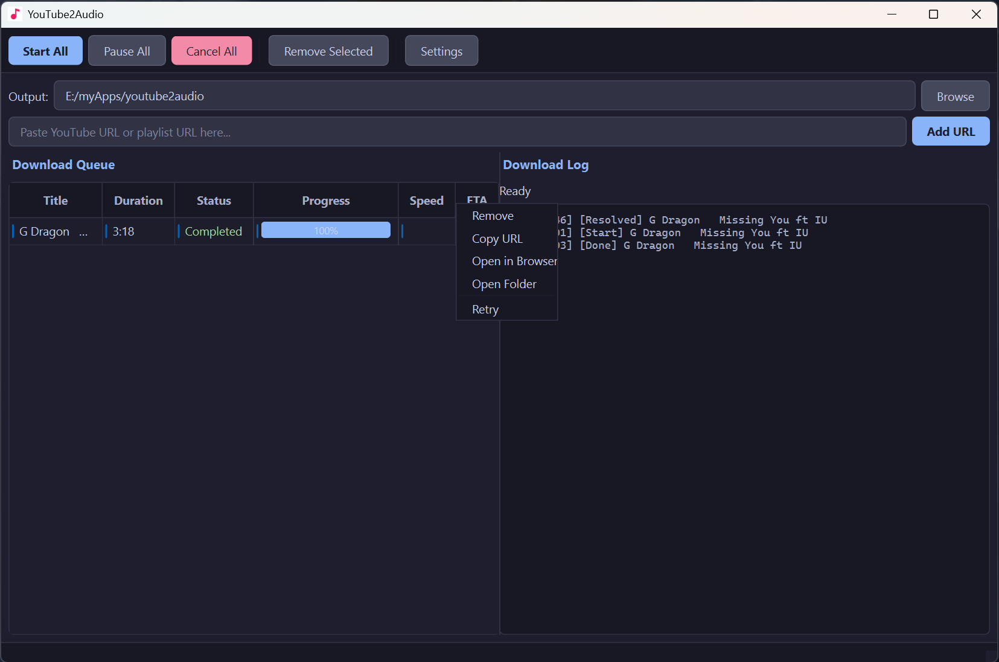

# YouTube2Audio — YouTube to MP3 / M4A Downloader for Windows

**YouTube2Audio** is a free, open-source Windows desktop app to download YouTube videos and playlists as high-quality audio files. Convert YouTube to MP3, M4A, Opus, or WAV with a single click — no browser extensions or online converters needed.


## Why YouTube2Audio?

- **YouTube to MP3** — download any YouTube video as an MP3 file
- **YouTube to M4A** — save audio in high-quality M4A (AAC) format
- **YouTube Playlist Downloader** — paste a playlist URL and download all tracks at once
- **Batch Audio Downloader** — queue multiple YouTube URLs and download them all
- **No Ads, No Limits** — completely free and open-source, runs locally on your PC

## Features

- **Drag & Drop** — drag YouTube URLs directly from your browser into the app
- **Playlist Support** — automatically expands YouTube playlists into individual tracks
- **Concurrent Downloads** — download multiple audio files simultaneously (configurable 1–10)
- **Real-time Progress** — progress bars, download speed, and ETA for each track
- **Pause / Resume** — pause and resume downloads at any time
- **Auto Retry** — failed downloads automatically retry up to 3 times
- **Multiple Audio Formats** — convert YouTube to MP3, M4A, Opus, or WAV
- **Bitrate Selection** — choose from 128, 192, 256, 320 kbps or best available quality
- **Dark Theme** — modern dark-themed user interface
- **Persistent Settings** — output folder, audio format, and window layout saved between sessions
- **Keyboard Shortcuts** — select and delete queued videos with Delete key

## Download

**[Download YouTube2Audio.exe](https://github.com/skypediacode/youtube2audio/raw/main/YouTube2Audio.exe)** — portable, no installation required.

## Screenshots

|            Main Window            |                   Parsed Playlist                   |
| :-------------------------------: | :-------------------------------------------------: |
|  |  |

|                            Downloading                             |                      Context Menu                      |
| :----------------------------------------------------------------: | :----------------------------------------------------: |
|  |  |

## Requirements

- Windows 10 or Windows 11
- [FFmpeg](https://ffmpeg.org/download.html) — required for all audio conversion (M4A and MP3)

## Installation (from source)

```bash
# Clone the repository
git clone https://github.com/skypediacode/youtube2audio.git
cd youtube2audio

# Create and activate virtual environment
python -m venv venv
venv\Scripts\activate

# Install dependencies
pip install -r requirements.txt

# Run the app
python main.py
```

## Usage

1. Launch the app — output folder defaults to your **Music** folder
2. Paste a YouTube video or playlist URL and click **Add URL**, or drag and drop from your browser
   - **Single video:** `https://www.youtube.com/watch?v=VIDEO_ID`
   - **Playlist:** `https://www.youtube.com/playlist?list=PLAYLIST_ID`
   - Both formats are supported — playlist URLs are automatically expanded into individual tracks
3. Click **Start All** to begin downloading audio
4. Downloaded MP3/M4A files appear in your output folder
5. Right-click completed downloads to **Open Folder** in Explorer

> **Tip:** To download a full playlist, go to the playlist page on YouTube and copy the URL from the address bar. URLs with both `v=` and `list=` parameters (copied from a video within a playlist) also work and will expand the entire playlist.

## Settings

Click **Settings** to configure:

| Option         | Default     | Description                                |
| -------------- | ----------- | ------------------------------------------ |
| Audio Format   | m4a         | m4a, mp3, opus, or wav                     |
| Bitrate        | Best (auto) | 128, 192, 256, 320 kbps, or best available |
| Max Concurrent | 3           | Simultaneous downloads (1–10)              |

## Build Executable

```bash
venv\Scripts\activate
pip install pyinstaller
python -m PyInstaller youtube2audio.spec --clean
```

Output: `dist\YouTube2Audio.exe`

## Tech Stack

- **Python 3.12+** — application language
- **PySide6** — cross-platform GUI framework
- **yt-dlp** — YouTube audio/video download backend
- **PyInstaller** — packages the app into a standalone `.exe`

## Project Structure

```
youtube2audio/
├── main.py                  # Entry point
├── requirements.txt         # Dependencies
├── build.bat                # Build script for .exe
├── music.ico                # App icon
├── src/
│   ├── app.py               # QApplication setup
│   ├── core/
│   │   ├── models.py        # Data models
│   │   ├── ytdlp_wrapper.py # yt-dlp integration
│   │   ├── url_resolver.py  # Async URL metadata fetcher
│   │   ├── download_worker.py   # Download thread
│   │   └── download_manager.py  # Queue and concurrency manager
│   ├── services/
│   │   └── settings_service.py  # QSettings persistence
│   └── ui/
│       ├── main_window.py       # Main window with drag-drop
│       ├── download_panel.py    # Download queue table
│       ├── status_panel.py      # Log panel
│       ├── url_input_bar.py     # URL input widget
│       ├── settings_dialog.py   # Settings modal
│       └── styles.py            # Dark theme stylesheet
```

## Keywords

youtube to mp3, youtube to m4a, youtube audio downloader, youtube playlist downloader, youtube mp3 converter, download youtube audio, youtube music downloader, yt-dlp gui, youtube to wav, batch youtube downloader, free youtube downloader windows

## License

MIT
